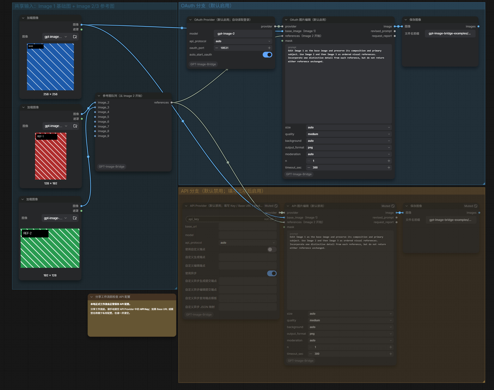

# ComfyUI GPT Image Bridge

面向 ComfyUI 的 GPT 图片生成与编辑节点包。支持：

- Codex / ChatGPT OAuth
- OpenAI 官方 API
- 使用 OpenAI 图片协议或 Chat Completions 图片协议的兼容 API
- 纯文生图、单图编辑和多参考图编辑
- 不同尺寸的参考图，并严格保持连接顺序
- JSON、SSE、Base64 和图片 URL 响应
- API Provider 内置“使用自定义端点”和“使用异步”开关
- 支持可配置的 Images API 异步任务提交、轮询和有限的安全回退
- 脱敏、可诊断的请求报告

OAuth 与 API Key 是两套独立的认证方式。OAuth 自动读取标准 Codex 登录状态；API 模式则由用户在节点中填写 Key、Base URL 和模型。

## 安装

### 使用 ComfyUI Manager（推荐）

本节点已发布到 [ComfyUI Registry](https://registry.comfy.org/publishers/lq36821/nodes/comfyui-gpt-image-bridge)，可以任选以下一种方式安装。

**通过示例工作流安装缺失节点**

1. [下载示例工作流 JSON](https://raw.githubusercontent.com/Liu-Bot24/comfyui-gpt-image-bridge/main/example_workflows/GPT-Image-Bridge-Edit-Example.json)。
2. 把 JSON 文件拖入 ComfyUI 画布，或通过“工作流 → 打开”加载。
3. 打开 ComfyUI Manager，选择 `Install Missing Custom Nodes`（安装缺失节点）。
4. 在缺失节点列表中安装 `GPT Image Bridge`，安装完成后重启 ComfyUI。
5. 重新加载示例工作流。

**直接搜索安装**

1. 打开 ComfyUI Manager，搜索 `GPT Image Bridge` 或 `comfyui-gpt-image-bridge`。
2. 点击安装，安装完成后重启 ComfyUI。

### 使用 Comfy CLI

```powershell
comfy node install comfyui-gpt-image-bridge
```

### 使用 Release 直装包

在 [GitHub Releases](https://github.com/Liu-Bot24/comfyui-gpt-image-bridge/releases/latest) 下载名称包含 `direct-install.zip` 的附件。不要下载 GitHub 自动生成的 `Source code` 压缩包。

1. 关闭 ComfyUI。
2. 将直装包直接解压到 ComfyUI 的 `custom_nodes` 目录。
3. 确认最终目录为 `custom_nodes/ComfyUI-GPT-Image-Bridge`，并且该目录内可以直接看到 `__init__.py`、`nodes.py` 和 `requirements.txt`，不要形成双层同名目录。
4. 如果已有同名节点目录，先备份旧目录，再用新目录完整替换；不要把不同版本的文件叠加混用。
5. 按当前 ComfyUI 安装方式，在节点目录中安装 `requirements.txt` 里的依赖，然后重启 ComfyUI。

直装包包含运行文件、文档、许可证、公开示例图片和公开示例工作流；不包含 API Key、OAuth Token、本机私有路径、测试文件、开发日志、用户私有图片或用户正式工作流。

### 使用 Git 克隆

也可以手动将仓库克隆到 ComfyUI 的 `custom_nodes` 目录：

```powershell
git clone https://github.com/Liu-Bot24/comfyui-gpt-image-bridge.git ComfyUI-GPT-Image-Bridge
```

进入节点目录并安装依赖：

```powershell
Set-Location ComfyUI-GPT-Image-Bridge
python -m pip install -r requirements.txt
```

重启 ComfyUI。这个包使用独立节点类名和目录，不会覆盖已有的 `Comfyui-GPT-img-node`。OAuth 不需要另外安装 Node.js、`npx` 或本地代理。

## 节点

| 节点 | 用途 |
|---|---|
| `GPT Image Bridge · Codex OAuth Provider` | 自动复用标准 Codex 登录状态 |
| `GPT Image Bridge · API Provider` | 填写 API Key、Base URL、模型和协议；内置自定义端点与异步开关 |
| `GPT Image Bridge · Edit Reference List (Image 2–9)` | 为 Edit 按 `image_2` 到 `image_9` 收集参考图 |
| `GPT Image Bridge · Generate` | 纯文生图，或直接连接最多 9 张参考图生成 |
| `GPT Image Bridge · Edit` | 编辑基础图，可附加参考图和 mask |

Generate 和 Edit 都输出：

- `image`：生成或编辑后的 ComfyUI IMAGE
- `revised_prompt`：服务返回的修订提示词，没有时为空
- `request_report`：经过脱敏的协议选择、端点、耗时和错误信息

## 使用 Codex OAuth

1. 确认 Codex CLI 或其他 Codex 客户端已经生成标准 Codex 登录文件。
2. 添加 `GPT Image Bridge · Codex OAuth Provider`。
3. 连接 Generate 或 Edit。

节点会自动查找标准 Codex 登录文件：

- `CODEX_HOME` 指向目录下的 `auth.json`
- 当前用户目录下的 `.codex/auth.json`

找到登录状态后，节点会读取并按需刷新 Codex OAuth Token，然后直接连接 ChatGPT Codex 图片端点；刷新成功后会把新 Token 原子写回同一个 `auth.json`，供 Codex 客户端继续复用。它不会下载或运行 npm 包，不会启动本地代理，也不需要用户填写 Token。工作流不保存认证文件路径或 OAuth Token，也不扫描浏览器数据、系统钥匙串或应用私有目录。任何已经生成标准 Codex 登录文件的 Codex/ChatGPT 客户端都可以被自动复用；只有应用自身的登录、但没有标准 Codex 登录文件时，节点无法直接读取该应用的私有会话。

如果找不到登录状态，节点会提示先完成 Codex 登录；错误信息不会显示解析后的本机绝对路径。

## 使用 API

1. 添加 `GPT Image Bridge · API Provider`。
2. 填写 `api_key`、`base_url` 和 `model`。
3. `api_protocol` 不确定时保持 `auto`。
4. 保持“使用异步”开启，或在只支持同步的供应商上将其关闭。
5. 只有供应商使用特殊路径时，才开启“使用自定义端点”并填写对应端点。
6. 连接 Generate 或 Edit。

API Provider 的配置会随本地工作流正常保存，包括 API Key、Base URL、模型、协议、开关、自定义端点和异步映射。API Key 在画布上只显示固定掩码，点击控件后在密码输入框中编辑。

> 工作流 JSON 中仍包含已保存的 API Key。分享工作流前，请手动检查并清空 API Provider 的 API Key、私有 Base URL、模型名称、自定义端点和异步 JSON 映射。关闭“使用自定义端点”只会让这些配置不参与执行，不会删除工作流中已经保存的文本。

排队执行时，前端会把 Key 换成一次性内存句柄再提交给 ComfyUI 队列，避免明文 Key 进入队列历史和生成图片的工作流元数据。这个过程不会清空或重置本地工作流中已经保存的配置。

Base URL 可以填写服务根地址或带 `/v1` 的地址。节点会规范化尾部斜杠，并避免拼出重复的 `/v1/v1`。

### API Provider 内置开关

- “使用自定义端点”默认关闭。关闭时，所有自定义同步端点、异步端点和响应映射都不会参与执行；已经填写的文本仍会保存在本地工作流中。
- “使用异步”默认开启。它只适用于最终选择为 `images` 的 API 请求。
- 这两个开关就是 API Provider 节点自身的控件，不需要额外添加 Boolean、Primitive 或工作流切换节点。

控件按用途分组排列：先是“使用自定义端点”及同步生成/编辑端点，随后是“使用异步”及异步提交、查询和响应映射。使用官方 API 或第三方兼容 API 的默认端点时，不需要填写自定义端点；只有供应商使用不同路径或异步响应格式时，才需要填写对应的自定义项。

“自定义生成端点”（内部字段 `generate_endpoint`）和“自定义编辑端点”（内部字段 `edit_endpoint`）填写的是同步业务端点：

- 留空时，节点使用所选协议的默认端点。
- 可以填写相对于 Base URL 的路径，例如 `chat/completions`。
- 也可以填写与 Base URL 同源的完整 URL，例如 `https://api.example.com/v1/chat/completions`。
- 非敏感查询参数可以保留，例如 `chat/completions?api-version=2026-01-01`；包含 Key、Token 等凭据的查询参数会被拒绝。
- 为避免把 API Key 发送给另一个服务，不同源的完整 URL 会被拒绝。

Generate 只读取自定义生成端点，Edit 只读取自定义编辑端点；填写其中一项不会改变另一项。使用节点内置的 Images 异步路径约定时，不要在同步端点中手动添加 `/async`，节点会从可识别的同步路径结构化派生异步路径。

### 异步任务模式

节点内置的 Images 异步路径约定为：

```text
/images/generations  →  /images/generations/async
/images/edits        →  /images/edits/async
任务查询              →  /images/tasks/{task_id}
```

节点提交任务后每 3 秒查询一次同一个任务，直到成功、明确失败、用户中断或达到 `timeout_sec`。这里的“异步”是供应商的任务协议；ComfyUI 节点仍会等待并轮询结果。

如果供应商不使用这套路径或 JSON 格式，开启“使用自定义端点”后可以填写：

- “自定义异步生成提交端点”：Generate 的异步任务创建地址。
- “自定义异步编辑提交端点”：Edit 的异步任务创建地址。
- “自定义异步查询端点模板”：必须恰好包含一个 `{task_id}`，例如 `jobs/{task_id}` 或 `jobs/status?id={task_id}`。
- “自定义异步 JSON 映射”：可选，用受限的 RFC 6901 JSON Pointer 指定任务 ID、状态、结果图片和错误字段。

异步提交固定使用 `POST`，并沿用对应 Images Generate/Edit 的请求体；轮询固定使用 `GET` 和 Bearer Authorization。自定义绝对地址必须与 Base URL 同源。需要其他 HTTP 方法、额外签名或供应商专用请求体的接口目前不属于这套通用适配范围。

下面是一个通用映射示例：

```json
{
  "task_id_paths": ["/job/id"],
  "status_paths": ["/job/state"],
  "result_paths": ["/job/output"],
  "image_items_paths": ["/pictures"],
  "image_b64_paths": ["/encoded"],
  "image_url_paths": ["/url"],
  "revised_prompt_paths": ["/caption"],
  "error_message_paths": ["/job/message"],
  "error_type_paths": ["/job/error_type"],
  "error_code_paths": ["/job/error_code"],
  "success_statuses": ["done"],
  "failure_statuses": ["failed", "rejected"]
}
```

每个 `*_paths` 都是按顺序尝试的字符串数组。`task_id_paths`、`status_paths`、`result_paths` 和错误字段从完整响应根开始；`image_items_paths` 从 `result_paths` 选中的结果开始；`image_b64_paths`、`image_url_paths` 和 `revised_prompt_paths` 从每个图片条目开始。未配置的项目继续兼容标准字段，如 `task_id`、`status`、`result.data[].b64_json` 和 `result.data[].url`。

`success_statuses` 或 `failure_statuses` 一旦填写，就会分别替换对应的默认集合，而不是追加；请把供应商可能返回的全部终态列全。映射只支持 JSON Pointer 和状态值数组，不执行脚本或 JSONPath。

同一个 API Provider 的 Generate 与 Edit 可以分别填写异步提交端点，但共享异步查询模板和 JSON 映射。如果同一供应商的生成、编辑任务连查询路径或返回结构也不同，请为两条分支各放一个 API Provider。

自动回退只发生在一个安全窗口：异步提交尚未取得任务 ID，并且服务器明确返回 `404`、`405` 或 `501`。此时节点才会对同一业务执行一次同步请求，并在 `request_report` 中记录 `sync_fallback`。

以下情况不会回退，也不会重新提交：鉴权失败、429、网络错误、超时、普通 5xx、异常响应，以及已经取得任务 ID 后的任务失败或轮询失败。这是为了避免服务端其实已经创建任务时出现重复生成或重复扣费。

Responses、Chat Completions 和 Codex OAuth 使用各自的同步模式。无法识别的自定义 Images 同步路径在没有填写自定义异步配置时也不会猜测异步路由；填写完整的异步提交端点与查询模板后才会使用自定义任务协议。

## 图片编号与参考顺序

Edit 使用专用的 `Edit Reference List (Image 2–9)`，图片角色固定为：

```text
Image 1 = base_image（Image 1），即待编辑的基础图
Image 2 = Edit Reference List 的 image_2，第 1 张参考图
Image 3 = Edit Reference List 的 image_3，第 2 张参考图
……
Image 9 = Edit Reference List 的 image_9，第 8 张参考图
```

基础图始终是待编辑对象。参考图只提供视觉参考，不会因为连接顺序而取代基础图。每个参考入口独立编码，因此参考图可以使用不同尺寸，不需要先拼成 IMAGE batch。

Generate 没有基础图。纯文生图时不要连接参考图；需要参考素材时，直接连接 Generate 节点上的参考图入口。新节点默认显示 3 个入口；连接当前最后一个入口后会自动增加下一个，最多扩展到 9 个：

```text
Reference 1 = reference_1
Reference 2 = reference_2
Reference 3 = reference_3
……
Reference 9 = reference_9
```

Generate 的所有图片都只是生成上下文，不会把其中一张当作待编辑底图。入口必须从 `reference_1` 开始连续连接；断开中间入口时，界面会自动压紧后续连接，后端也会在网络请求前拒绝任何残留空洞。每个入口只接受一张 IMAGE，批量参考请拆到后续编号入口，避免画布编号、报告编号和远端请求顺序不一致。Generate 不再使用 Reference List；Reference List 仅供 Edit 使用。

单图编辑时只连接 `base_image（Image 1）`，不连接 Edit Reference List 即可。

## 生成与编辑参数

| 参数 | 含义 |
|---|---|
| `prompt` | 图片生成或编辑指令 |
| `size` | 输出尺寸；`auto` 交给服务决定 |
| `quality` | 输出质量档位；不同服务支持范围可能不同 |
| `background` | `auto`、不透明或透明背景；需服务与格式支持 |
| `output_format` | `png`、`jpeg` 或 `webp` |
| `moderation` | 服务支持的内容审核强度；不支持时可能被拒绝 |
| `n` | 请求输出数量，范围 1–8；实际能力和费用由服务决定 |
| `timeout_sec` | 同步模式下是请求超时；异步模式下是提交、轮询和结果取回的总等待上限，范围 30–3600 |

异步达到上限时只会停止本地等待，不代表远端任务已被取消。兼容 API 不一定支持所有参数；服务拒绝某个参数时，`request_report` 会保留脱敏后的状态码、request ID、错误类型和协议信息。

## 协议选择

`api_protocol` 可选：

- `auto`：根据认证方式、Generate/Edit、参考图和 mask 确定协议
- `responses`：使用 `/responses`
- `images`：使用 `/images/generations` 或 `/images/edits`
- `chat_completions`：使用 Chat Completions 图片请求；默认端点为 `/chat/completions`

端点留空时，`auto` 仍按既有规则确定：

| 场景 | 端点 |
|---|---|
| OAuth Generate | `/responses` |
| OAuth Edit | `/images/edits` |
| API 纯文生图 | `/images/generations` |
| API 带参考图生成 | `/responses` |
| API Edit | `/images/edits` |

开启“使用自定义端点”后，如果手动端点明确以 `/chat/completions`、`/responses`、`/images/generations` 或 `/images/edits` 结尾，`auto` 会依据该端点选择请求格式，并在报告中记录依据。自定义路径无法识别时，应同时显式选择协议。

除“异步端点明确不支持后回到同一 Images 业务的同步端点”外，节点不会在失败后切换到语义不同的协议或业务端点。显式协议与可识别端点冲突、Generate/Edit 端点填反，或输入能力冲突时都会在请求前给出可诊断错误。

协议差异：

- Responses 支持普通 JSON 和 SSE。
- Images API 支持 `b64_json` 和图片 URL；下载 URL 时会校验公网地址、scheme、MIME、文件大小和图片尺寸，并且不会转发 Authorization。诊断报告会清除 URL 查询参数值。
- 使用内置 Images 异步路径时，任务创建请求只发送一次；创建结果不确定时不会自动重提。任务轮询始终查询原任务 ID。
- Chat Completions 按 `text → Image 1 → Image 2…` 发送多模态消息，支持常见的 Base64、Data URL、结构化图片 URL 和 Markdown 图片返回；端点名称相同不代表每个供应商都实现了这些能力。
- Chat Completions 中，`size` 会作为文本指令发送；`quality`、`background`、`output_format` 和 `moderation` 不会冒充通用字段发送，`n` 通过逐次请求实现，mask 会明确报不支持。实际处理方式会写入请求报告。
- Codex OAuth 的 Edit 路径最多接受 5 张有序图片（Image 1 基础图，加最多 4 张参考图），不支持 mask 或 `output_format`；节点使用 Base64 返回方式，并在报告中注明被忽略或不支持的选项。
- 带 Authorization 的 API 请求不会跟随 HTTP 重定向；请把 Base URL/端点直接配置为最终地址，避免凭据被带到非预期目标。
- 可能创建付费图片任务的 POST 请求只提交一次，不会因网络错误、429 或 5xx 自动重提。任务轮询和既有图片 URL 下载可以对可重试错误做有限重试；401、403、普通 4xx 和安全拒绝不重试。

## 示例工作流

仓库提供以下示例工作流：

[查看示例工作流：GPT Image Bridge 图片编辑](example_workflows/GPT-Image-Bridge-Edit-Example.json)



示例在同一画布中包含 OAuth 和 API 两条图片编辑分支：

- OAuth 分支默认启用，可自动读取当前设备上的标准 Codex 登录状态。
- API 分支默认禁用，Key、Base URL、模型和自定义端点均为空。
- API Provider 的“使用自定义端点”默认关闭，“使用异步”默认开启；两者都是节点内置控件。
- 三张输入图分别明确标为 Image 1、Image 2 和 Image 3。
- API Provider 旁带有分享工作流前清空私密配置的提醒。
- 不依赖 Checkpoint、VAE、LoRA、CLIP、采样器或其他本地模型。

测试 API 分支时：

1. 在 API Provider 中填写 Key、Base URL 和模型；供应商需要特殊路径时再开启自定义端点。
2. 将 API Provider、API Edit 和 API Save Image 三个节点改为“始终”。
3. 将 OAuth Provider、OAuth Edit 和 OAuth Save Image 三个节点改为“从不”。

示例工作流本身不包含 API Key、Token、用户目录、开发机路径或其他本地工作流内容。用户填写后的副本会按正常工作流行为保存配置。

## 隐私与错误报告

- OAuth Token 和认证文件内容不会写入工作流。
- API Key 会按用户预期保存在本地工作流，但画布不显示明文。
- 分享工作流前需要由用户主动清空 API Provider 中的私密配置；关闭自定义端点开关并不等于删除已保存的端点文本。
- 请求报告、日志和异常会移除 Authorization、Token、Key、完整 Base64 图片和敏感请求体。
- 网络请求只会在节点实际执行时发出；旁路或禁用的节点不会调用网络。

## License

MIT
